# Cross-Chain Price Feed Oracle

## Overview

Automatically mirror official Chainlink Price Feeds from an origin chain to a destination chain using Reactive Network's event-driven architecture. The destination chain exposes a read interface compatible with `AggregatorV3Interface`, enabling DeFi applications to consume price data where native Chainlink feeds are unavailable.

### How It Works

1. **Origin Chain**: Listen to Chainlink aggregator events (AnswerUpdated) to capture round data (roundId, answer, updatedAt, etc.)
2. **Reactive Contract**: Subscribe to events and encode cross-chain messages with feed data
3. **Destination Chain**: Store price data in a minimal FeedProxy contract that exposes the standard AggregatorV3Interface for downstream applications

### Architecture Diagram

```mermaid
graph TD
    A["🔗 Chainlink Oracle<br/>(Mainnet)<br/>AnswerUpdated Event"]
    B["⚡ PriceFeedReactive<br/>(Reactive Network)<br/>Decodes & Relays"]
    C["🔗 PriceFeedProxy<br/>(Sepolia)<br/>Stores & Exposes"]
    D["📱 DApps<br/>Read Price Data<br/>latestRoundData()"]

    A -->|roundId, answer,<br/>updatedAt, etc| B
    B -->|updateAnswer<br/>callback| C
    C -->|AggregatorV3<br/>Interface| D
```



### Workflow Sequence


## Contracts

Core contracts can be found in the `src/pricefeed-oracle` directory:

1. **PriceFeedProxy (Destination)**: `PriceFeedProxy.sol` - Stores price feed data (roundId, answer, startedAt, updatedAt, answeredInRound, decimals, description) and exposes `AggregatorV3Interface` functions for downstream applications to read price data to consume price data where native Chainlink feeds are unavailable.

2. **PriceFeedReactive (Reactive Network)**: `PriceFeedReactive.sol` - Listens for `AnswerUpdated` event from the Chainlink aggregator on the origin chain, decodes price updates, and sends cross-chain messages to the destination FeedProxy to update price data.

## Getting Started

### Prerequisites

- [Node.js](https://nodejs.org/en/download/)

- [Foundry](https://book.getfoundry.sh/)

To set up foundry environment, run:

```bash
curl -L https://foundry.paradigm.xyz | bash
source ~/.bashrc
foundryup
```

- Etherem wallet with Some funds on origin and destination chains

To deploy contracts, follow these steps, making sure you substitute the appropriate keys, addresses, and endpoints where necessary. You will need the following environment variables configured appropriately to follow this script:

```.env
DESTINATION_RPC=
REACTIVE_RPC=
PRIVATE_KEY=
ORIGIN_CHAINID=
ORIGIN_ADDR=
DESTINATION_CHAINID=
DESTINATION_ADDR=
SYSTEM_CONTRACT_ADDR=
DESTINATION_CALLBACK_SENDER_ADDR=
FEED_DECIMALS=
FEED_DESCRIPTION=
FEED_VERSION=
```

You can use the recommended Sepolia RPC URL: `https://rpc2.sepolia.org`.

Load the environment variables:

```bash
source .env
```

### Compile & Deploy Contracts

This project is scaffolded using Foundry, a smart contract development toolchain. Please refer to the [Foundry documentation](https://book.getfoundry.sh/) for more details.

Directory Structure:

```bash
├── README.md
├── lib # forge, reactive libs
├── src
│    ├── pricefeed-oracle #
│         ├── PriceFeedProxy.sol # AggregatorV3 Compatible Price Feed proxy contract for downstream dapps
│         ├── PriceFeedReactive.sol # Price Feed reactive contract
```

Install dependencies and compile the contracts:

```bash
forge install

forge compile
```

Deploy the `PriceFeedProxy` contract with authorized callback sender on destination(i.e Avalanche) and assign the `Deployed to` address from the response to `DESTINATION_ADDR`.

```bash
forge create src/pricefeed-oracle/PriceFeedProxy.sol:PriceFeedProxy --rpc-url $DESTINATION_RPC --private-key $PRIVATE_KEY --constructor-args $DESTINATION_CALLBACK_SENDER_ADDR $FEED_DECIMALS $FEED_DESCRIPTION
```

### Callback Payment

To ensure a successful callback, `PriceFeedProxy` contract must have an ETH balance. You can find more details [here](https://dev.reactive.network/economy#callback-payments). To fund the callback contracts, run the following command:

```bash
cast send $DESTINATION_ADDR --rpc-url $DESTINATION_RPC --private-key $PRIVATE_KEY --value 0.2ether
```

### Deploy Reactive Contract

Deploy the `PriceFeedReactive.sol` (reactive contract), configuring it to listen to `AnswerUpdated` event on origin contract, Triggering callback on `PriceFeedProxy.sol` contract to updat price feed data accordingly.

```bash
forge create --rpc-url $REACTIVE_RPC --private-key $PRIVATE_KEY src/pricefeed-oracle/PriceFeedReactive.sol:PriceFeedReactive --constructor-args $SYSTEM_CONTRACT_ADDR $ORIGIN_CHAINID $ORIGIN_ADDR $DESTINATION_CHAINID $DESTINATION_ADDR $FEED_DECIMALS $FEED_DESCRIPTION $FEED_VERSION
```

### Test the Setup

### Deployed Contracts

- **PriceFeedProxy(Destination) contract:** [0xb689ac1d2B794da8cABD34544083DC4921BCEF2C](https://sepolia.etherscan.io/address/0xb689ac1d2B794da8cABD34544083DC4921BCEF2C)
- **PriceFeedReactive contract:** [0x6d21161d1D17cDCA58707829E4d57D5a4EfE5489](https://lasna.reactscan.net/address/0xc7203561ef179333005a9b81215092413ab86ae9/contract/0x6d21161d1D17cDCA58707829E4d57D5a4EfE5489)
- **RVM:** [0xc7203561EF179333005a9b81215092413aB86aE9](https://lasna.reactscan.net/address/0xc7203561ef179333005a9b81215092413ab86ae9)

#### Workflow Example

The price feed oracle operates in a fully automated, event-driven workflow:

**Step 1: Chainlink Price Update (Ethereum Mainnet)**

- The Chainlink ETH/USD aggregator emits an `AnswerUpdated` event with new price data
- Event contains: `roundId`, `answer` (price), `startedAt`, `updatedAt`, `answeredInRound`

**Step 2: Reactive Contract Detects Event (Reactive Network)**

- The `PriceFeedReactive` contract is subscribed to the `AnswerUpdated` event on the Chainlink aggregator
- When an event is detected, the ReactVM triggers the contract's `react()` callback
- The contract decodes the event data to extract: roundId, answer (int256), updatedAt, and other metadata

**Step 3: Cross-Chain Message Encoded**

- The reactive contract encodes a cross-chain message containing:
  - `roundId` - Unique identifier for the price round
  - `answer` - The price value (as int256, e.g., 260000000000 for $2600 USD)
  - `updatedAt` - Timestamp of the price update
  - `startedAt` - Timestamp when the round started
  - `decimals` - Number of decimal places (e.g., 8 for $2,600.00000000)
  - `description` - Feed description (e.g., "ETH / USD")

**Step 4: Cross-Chain Callback Triggered**

- The reactive contract emits a callback event targeting the `PriceFeedProxy` on Ethereum Sepolia
- The message is relayed through the Reactive Network to the destination chain

**Step 5: PriceFeedProxy Updates (Ethereum Sepolia)**

- The `PriceFeedProxy` contract receives the callback and executes `updateAnswer()`
- The new round data is stored:
  - Latest round: stored in `latestRound` struct
  - Historical data: stored in `rounds[roundId]` mapping
  - An `AnswerUpdated` event is emitted on Sepolia

**Step 6: DApps Consume Data**

- Downstream applications on Sepolia can now call `latestRoundData()` on the proxy
- Applications receive the mirrored price data in standard AggregatorV3Interface format
- Price is available for lending protocols, DEXs, and other DeFi applications

#### Example Transaction Flow

1. **Origin Event**: Chainlink aggregator on Ethereum Mainnet: `AnswerUpdated(roundId: 123, answer: 260000000000, updatedAt: 1732828800)`
2. **Reactive Detection**: PriceFeedReactive detects event and calls react callback
3. **Message Encoding**: Encodes `updateAnswer(123, 260000000000, 1732828800, ...)`
4. **Destination Update**: PriceFeedProxy on Sepolia stores the new round data
5. **DApp Integration**: A lending protocol on Sepolia calls `latestRoundData()` and gets the ETH/USD price

## Built With

- [Reactive Network](https://reactive.network) - Facilitates seamless cross-chain and multi-chain interactions, breaking down barriers for true blockchain interoperability.
- [Reactive Library](https://dev.reactive.network/reactive-library#overview) - Set of abstract contracts and interfaces that reduce boilerplate by integrating common functionalities
- [Foundry](https://book.getfoundry.sh/) - A smart contract development toolchain. It provides a set of tools to help you build, test, and deploy smart contracts.
- [Solidity](https://docs.soliditylang.org/en/v0.8.24/) - Ethereum's smart contract programming language

## Safety & Security

This is experimental software and subject to change over time.

This is a proof of concept and is not ready for production use. It is not audited and has not been tested for security. Use at your own risk. I do not give any warranties and will not be liable for any loss incurred through any use of this codebase.

## License

This project is licensed under the MIT License - see the [LICENSE](LICENSE) file for details.
